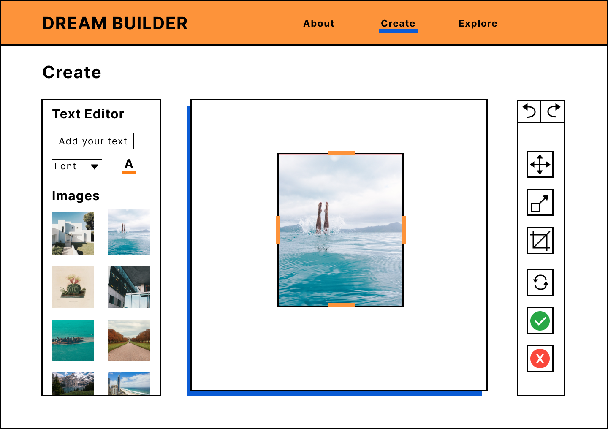

Last summer, Civic Square announced the
[Dream Fund](https://civicsquare.cc/dreams/fund/?mc_cid=78ec180c5a&mc_eid=4c5a94dd79) -
an open call for proposals that make steps towards a collective future with the
capacity to dream.

> The Dream Fund exists to unlock and resource the bold, creative, regenerative
> dreams that are inside us and move them into the everyday consciousness of
> many.

## Our proposal

We asked ourselves, how can we provide building blocks to play with and create a
vision of our collective futures?

Our proposal was to create a collective Dream Builder.

## What is the Dream Builder?

The Dream Builder is an online tool to create your own digital dream board, from
a curated collection of open image libraries.

### What is a dream board?

A dream board is a collage of images and text that represent your vision of the
future.

## How does it work?

### Exploring Images

Usually, physical dream boards are made from collages of magazine or newspaper
clippings, or other printed materials.

Perusing these images libraries is a joyful practice, the only difficult part of
curating them will be whittling down the choices. Variety is key, looking beyond
my own dream landscape to provide stimuli that speaks to the hearts of many.
People interpret things in different ways and, much like the way we assign
meaning to the symbols of our sleeping dreams, we each create our own
symbol-icon-meaning-dictionary.

We'll be using the Unsplash API to gather high-quality images from the huge
collection on [Unsplash](https://unsplash.com/).

The complex part of this process is building an interface for users to browse
these image libraries - preferably without having to leave the same page. When
the user resonates with an image, they'll want to save it into an image bank or
media library to use later on for their digital collage. The experience should
be intuitive and familiar, with little need for explanation.

The images will be curated into categories called collections, examples can be
nature, people, places, things. Each collection is represented by one image and
a title - just like photo albums. Clicking on this image opens up the whole
collection. I played around with a few different ways of doing this. Initially,
I thought of designing a small bucket icon (to represent your media library) at
the top of the page and users can drag and drop the images they like into it. On
second thoughts, this could be cumbersome, especially if you are dragging an
image from the bottom of the page up to the top. It's time consuming, repetitive
and often these mechanisms don't work smoothly with the page-scrolling.

Instead, we are mostly all familiar with the little heart icon we use to 'like'
on social media, or 'favourite' images in our phone galleries, or add items to a
wishlist when shopping online. It's recognisable and intuitive. All it takes is
one click or a double tap on mobile. The images are saved to a media library
that you can access at the next step - the canvas for creating your dream board.

### Image Rights

One of the most important things to consider for this project is the usage
rights of each image. Typically, magazine images are licensed by the image
author - they are given rights to use the image for a set amount of time, either
by the photographer, illustrator or artist. It can get complicated. For a
personal collage, there's not much to be concerned with. When it comes to
sharing images online for free, best practices are to credit the author. This
would be challenging for our project as we need a high volume of images and we
don't know which ones will be used.

Luckily, all of the images on Unsplash are licensed under the generous Unsplash
Licenses, giving everyone free reign to use and modify images.

### Canvas

Once you've chosen your images and ruminated on your vision of the future,
you're ready to start creating. Clicking the 'create' button will take you to
the canvas. The canvas and editing tools, are easily the most complex part of
the dream builder - to design and build. We don't want to distract the user from
their creative process with too many options, confusing design or tools that
don't work.

When making a physical dream board or any collage, usually you cut out shapes or
images and paste them to your canvas, layering up to create a collage. We want
to recreate this experience. In the middle of the page is your canvas, on the
left is your image bank/media library. On the right is your editing tool box.
You can scroll through the image bank, drag an image on to the canvas and choose
to crop, scale and position the image (on top or below). There is also a button
to add text to the page, type in the affirmation, quote, word or letters your
wish and resize, change the font or colour.

While this sounds simple, behind the user interface there is a lot happening at
once to make this possible. Most of us have used a simple image editor before,
maybe Adobe or Inkscape, or in a web browser or on our phones.

But what exactly is happening when we resize an image or crop a photo to fit
into a square? In most cases, we use our mouse pointer or finger to drag the
corners of the image to resize it. For cropping, a rectangular outline is place
over the image, again you drag the edges/corners where you want to crop. Moving
the image also requires dragging and dropping in place. So while the outcome of
each three tools are different, the user process is the same.

## Mobile Friendly

We design with a mobile-first approach to make sure websites and apps are
optimal for all devices. The layout for the homepage and image collection is
relatively simple to make responsive. The canvas page is more difficult as we
want the majority of the screen to be taken up by the canvas, so the user has
plenty of space to create.

On desktop, there is plenty of space on either side of a square canvas to fit
the editing tools (square dimensions also fits better on all devices). On a
mobile or tablet device, the viewport is vertical so it makes sense to put the
tool bar above or below the canvas. I put the toolbar at the bottom of the page
so it's easier for thumbs to reach. The image library can be accessed by tapping
an icon (circle with plus) rather than take up a lot of screen space. The user
can scroll through and select images by dragging on to the canvas/double
tapping.

The editing tools work in the same way as on desktop, except using a finger to
tap rather than mouse-click. It's important to think about differences such as
no right-click - this may be activated by holding down with a finger instead.
For crop, a tick or cross button appearing will allow the user to confirm the
new crop position.

**Stay tuned for more updates on the Dream Builder progress.**
